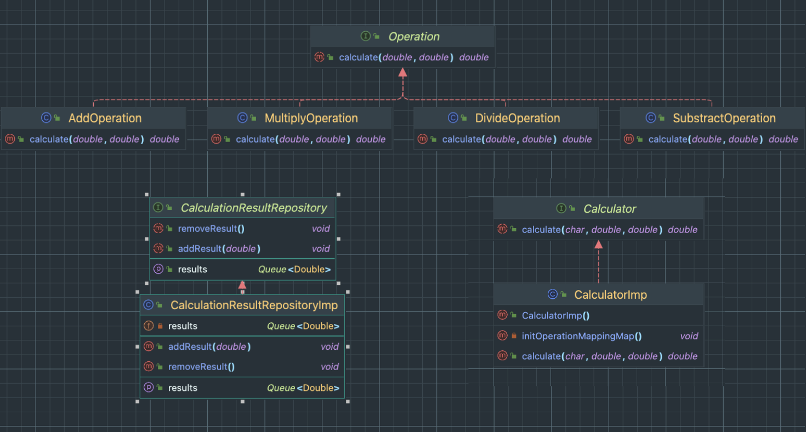

_# 계산기 만들기


> ### 목차
>- [Lv1 - 계산기](#Lv1-계산기)
>- [Lv2 - 계산기](#Lv2-계산기)

<br/>

## Lv1 계산기


### 요구사항
- 콘솔 기반
- 정수값 입력 받기
-  사칙연산 ( `+`, `-`, `*`, `/` )
- 예외처리 - 나누기 `0` 지원 X
- 계산 반복

<br/>

<details>

<summary> 사칙연산 - if 문, 예외처리 </summary>

```java
public double calculate1(Character operator, int a, int b) {
    double answer = 0;

    if (operator.equals('+')) {
        answer = a + b;
    } else if (operator.equals('-')) {
        answer = a - b;
    } else if (operator.equals('*')) {
        answer = a * b;
    } else if (operator.equals('/')) {
        if(b==0) throw  new ArithmeticException("0으로 나눗셈 연산이 불가합니다.");
        answer = a / b;
    } else {
        throw new UnsupportedOperationException("지원되지 않는 연산자 입니다.");
    }
    return answer;
}
```

</details>


<details>

<summary> 사칙연산 - switch 문, 예외처리 </summary>

```java
public int calculate2(char operation, int a, int b) {
    switch (operation) {
        case '+': return a + b;
        case '-': return a - b;
        case '*': return a * b;
        case '/': {
            try{
                return a / b;
            } catch (ArithmeticException e){
                throw  new ArithmeticException("0으로 나눗셈 연산이 불가합니다.");
            }
        }
        default: throw new UnsupportedOperationException("지원되지 않는 연산자 입니다.");
    }
}

```

</details>


<details>
  <summary>계산 반복 - do - while문, 삼항연산자 </summary>
  
```java
int result = 0;

System.out.print("첫 번째 숫자를 입력하세요:");
int num1 = sc.nextInt();
System.out.print("두 번째 숫자를 입력하세요:");
int num2 = sc.nextInt();
System.out.print("사칙연산 기호를 입력하세요: ");
char operator = sc.next().charAt(0);

Boolean isCalculationRepeat = false;

// 계산 반복, do - while 문  
do {
    if(!isCalculationRepeat) {
        result = calculator.calculate1(operator, num1, num2);
    } else {
        System.out.print("계산을 추가할 숫자를 입력하세요:");
        int repeatNum = sc.nextInt();
        System.out.print("추가 사칙연산 기호를 입력하세요: ");
        char repeatOperator = sc.next().charAt(0);
        int n = calculator.calculate1(repeatOperator, result, repeatNum);
        result = n;
    }
    System.out.println("더 계산하시겠습니까? (exit 입력 시 종료)");
    String s = sc.next();
    isCalculationRepeat = s.equals("exit")? false : true;
}  while(isCalculationRepeat);
System.out.println("결과 값 = " + result );
}

```

</details>


<br/>
<br/>


## Lv2 계산기 

### 요구사항
- 클래스 분리
- 연산 결과, 저장, 조회, 삭제 ( 캡슐화, getter, setter 사용)


### 추가 적용
- 다형성 및 SOLID 원칙 준수를 위해 interface로 생성 후 구현
- 어댑터 패턴 적용

<br/>

### 클래스 다이어 그램





### 사칙연산 - interface 생성 및   클래스 분리 

<details>
  <summary> [ interface ] Operation  </summary>

```java
package calculator.lv2.operation;

public interface Operation {
    double calculate(double a, double b);
}
```

</details>


<details>
  <summary> AddOperation </summary>
 
```java
package calculator.lv2.operation;

public class AddOperation implements Operation {

    @Override
    public double calculate(double a, double b) {
        return a + b;
    }
}
```


</details>


<details>
  <summary> MultipleOperation </summary>

```java
package calculator.lv2.operation;

public class MultiplyOperation implements Operation {

    @Override
    public double calculate(double a, double b) {
        return a * b;
    }
}
```

</details>


<details>
  <summary> DivideOperation </summary>

```java
package calculator.lv2.operation;

public class DivideOperation implements Operation {

    @Override
    public double calculate(double a, double b) {
        if(b==0) throw  new ArithmeticException("0으로 나눗셈 연산이 불가합니다.");
        return a / b;
    }
}
``` 


</details>


<details>
  <summary> SubstractOperation </summary>

```java
package calculator.lv2.operation;

public class SubstractOperation implements Operation {
    @Override
    public double calculate(double a, double b) {
        return a - b;
    }
}
```

</details>


<br/>

### 결과값 저장, 조회, 삭제 -  repository 

<details>
  <summary>  [ interface ] CalculationResultRepository  </summary>

 ```java
package calculator.lv2.repository;

import java.util.Queue;

public interface CalculationResultRepository {
    void addResult(double result);
    Queue<Double> getResults();
    void removeResult();
}
```   

</details>

<details>
  <summary> CalculationResultRepositoryImp  </summary>

 ```java
package calculator.lv2.repository;

import java.util.LinkedList;
import java.util.Queue;

public class CalculationResultRepositoryImp implements CalculationResultRepository{
    private final Queue<Double> results = new LinkedList<>();

    @Override
    public void addResult(double result){
        results.add(result);
        System.out.println("계산한 결과 값인  '" + result + "' 가 저장 되었습니다.");
    }

    @Override
    public Queue<Double> getResults(){
        return results;
    }

    @Override
    public void removeResult() {
        Double removeNumber = results.remove();
        System.out.println("저장된 결과 값인  '" + removeNumber + "' 가 삭제 되었습니다.");
    }
}
```   

</details>


<details>
  <summary>  Main - 계산 결과 값 저장 및 조회  </summary>

 ```java
// 계산 결과 값 저장 및 조회
repository.addResult(result);
repository.getResults().forEach(n -> System.out.println("저장된 결과: " + n));

// 삭제
repository.removeResult();
System.out.println("삭제 후 결과:");
repository.getResults().forEach(n -> System.out.println("저장된 결과: " + n))lculate(char operator, double a, double b);
```

</details>

<br/>

### 계산기 - 어댑터 패턴 적용

<details>
  <summary>  [ interface ] Calculator  </summary>

 ```java
package calculator.lv2;

public interface Calculator {

    double calculate(char operator, double a, double b);
}
```   

</details>

<details>
  <summary> CalculatorImp </summary>

 ```java
package calculator.lv2;


import calculator.lv2.operation.*;

import java.util.HashMap;
import java.util.Map;


public class CalculatorImp implements Calculator {
    // 어댑터 저장을 위한 Map
    private final Map<Character, Operation> operationMappingAapter = new HashMap<>();

    public CalculatorImp() {
        initOperationMappingMap();
    }
    
    // 인스턴스 초기화 시, 각 연산자에 해당하는 어댑터 생성 
    private void initOperationMappingMap(){
        operationMappingAapter.put('+', new AddOperation());
        operationMappingAapter.put('-', new SubstractOperation());
        operationMappingAapter.put('*', new MultiplyOperation());
        operationMappingAapter.put('/', new DivideOperation());
    }


    @Override
    public double calculate(char operator, double a, double b){
        // 받아온 연산자에 해당하는 어댑터 조회
        Operation mappingOperation = operationMappingAapter.get(operator);
        
        if (mappingOperation == null) {
            throw new UnsupportedOperationException("Unknown operation: " + operator);
        }
        return mappingOperation.calculate(a, b);
    }
}
```   

</details>

<br/>

### 생성자 주입, ( 입력값, 계산 반복 ) 로직 리펙토링
<details>
  <summary> DIP 준수 - 생성자 주입 </summary>

> DIP: 의존성 역전 원칙, 고수준의 모듈은 저수준의 모듈에 의존해서는 안된다.
- DIP 준수를 위해 interface로 의존성 형성 및 생성자 주입 사용


 ```java
public class Main {
    
}
    private Calculator calculator;
    private CalculationResultRepository repository;

    // 생성자 주입
    public Main(Calculator calculator, CalculationResultRepository repository) {
        this.calculator = calculator;
        this.repository = repository;
    }


    public static void main(String[] args) {
        Main main = new Main(new CalculatorImp(), new CalculationResultRepositoryImp());
        
    .  .  .
```   


</details>


<details>
  <summary>  [ enum ] InputEnum </summary>

- 안정성을 높이기 위해 enum 으로 설계함

 ```java
package calculator.lv2.enums;

public enum InputEnum {
    NUMBER, OPERATOR, EXIT
}
```   

</details>

<details>
  <summary> 입력 로직 메서드 생성 </summary>

- 동일한 로직이 중복되어서 메서드로 만듬
- 근데 좋은 코드는 아닌 것 같음

 ```java
public <T> T input(String message, Scanner sc, InputEnum type){
    System.out.print(message);
    Object input = null;

    switch (type){
        case NUMBER :
            if (sc.hasNextDouble()) {
                input = sc.nextDouble();  // 소수점이 있는 숫자 또는 정수를 입력받음
            } else {
                System.out.println("잘못된 숫자 입력입니다.");
                sc.next();  // 잘못된 입력 제거
            }
            break;
        case OPERATOR:
            input = sc.next().charAt(0);  // 연산자 입력
            break;
        case EXIT:
            input = sc.next();  // 종료 문자열 입력
            break;
    }
    return (T) input;
}
```   

</details>


<details>
  <summary> 계산 반복 로직 리펙토링</summary>

- 가독성을 높이기 위해 while문으로 변경함

 ```java
 // 계산 반복
Boolean isCalculating = false;
while (isCalculating) {
    result = main.calculator.calculate(operator, num1, num2);
    System.out.println("현재 결과: " + result);

    // 추가 계산 여부 확인
    String continueInput = main.input("더 계산하시겠습니까? (exit 입력 시 종료): ", sc, InputEnum.EXIT);
    isCalculating = !continueInput.equalsIgnoreCase("exit");

    // 추가 계산
    if (isCalculating) {
        double repeatNum = main.input("계산을 추가할 숫자를 입력하세요:", sc, InputEnum.NUMBER);
        char repeatOperator = main.input("추가 사칙연산 기호를 입력하세요: ", sc, InputEnum.OPERATOR);
        result = main.calculator.calculate(repeatOperator, result, repeatNum);
    }
}
```   

</details>


<br/>
<br/>
