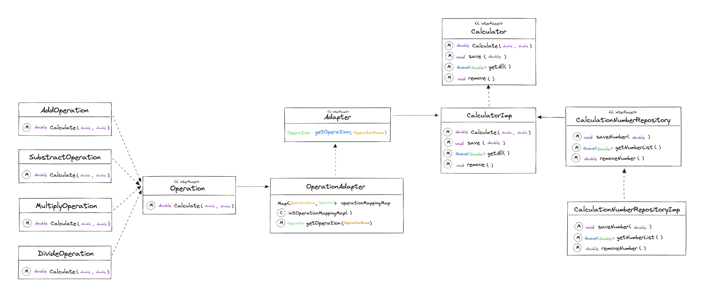

_# 계산기 만들기

> ### 목차
>- [Lv1 - 계산기](#Lv1-계산기)
>- [Lv2 - 계산기](#Lv2-계산기)

 

## Lv1 계산기

### 요구사항
- 콘솔 기반
- 한 클래스로 처리
- 정수값 입력 받기
-  사칙연산 ( `+`, `-`, `*`, `/` )
- 예외처리 - 나누기 `0` 지원 X
- 계산 반복

 
 

## Lv2, 3 계산기 

### 요구사항
- 클래스 분리
- 연산 결과, 저장, 조회, 삭제 ( 캡슐화, getter, setter 사용)
- Enum 타입 적용
- 재네릭 적용

### 추가 적용
- 다형성 및 SOLID 원칙 준수
- 전략 패턴

 

### 클래스 다이어 그램

 
 
 
